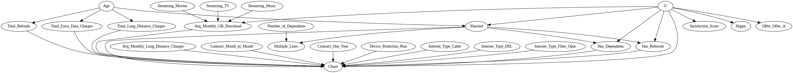

# Driving Customer Retention: A Causal Approach to Churn Prediction and Strategy

This project tackles customer churn—when customers stop using a service—by combining supervised machine learning with causal inference to pinpoint factors driving customer retention. Reducing churn is crucial as retaining existing customers is often more cost-effective than acquiring new ones. Using IBM telecom data, we identified the causes of churn and developed a targeted strategy based on the impact of specific offers and interventions. This approach allows for effective churn prediction while guiding actionable strategies to enhance customer loyalty.

## Built With
<table>
  <tr>
    <td align="center">
      
       Python
    </td>
    <td align="center">
      
       DoWhy
    </td>
  </tr>
</table>

## Causal Graph

<td align="center">
    
</td>
A causal graph is a visual representation of cause-and-effect relationships between variables, where nodes represent variables, and directed edges (arrows) indicate causal influence. By showing dependencies, it helps identify pathways, confounding factors, and the structure of causal mechanisms in a system, aiding in clearer causal inference and analysis.

